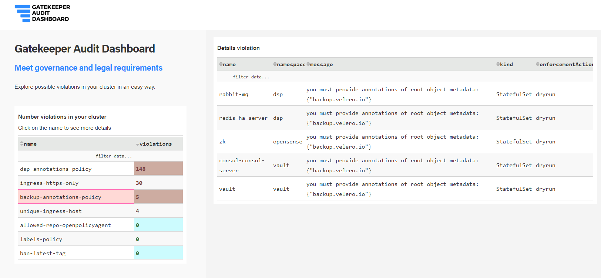

# Gatekeeper Audit Dashboard

Audit Dashboard for Gatekeeper (OPA)



## Overview

_Gatekeeper Audit Dashboard_ makes easy to visualize violations in your cluster. This tool helps you to report inconsistencies in your policies which are essential to meet governance and legal requirements.

## How to use Gatekeeper Audit Dashboard

The dashboard is writen in **python** and uses [dash](https://plotly.com/dash/) library for UI interactions. You must have [**Gatekeeper**](https://github.com/open-policy-agent/gatekeeper) installed in your cluster and the **[audit](https://github.com/open-policy-agent/gatekeeper#audit)** mode enabled.

### Installation

You can use [kustomize](https://github.com/kubernetes-sigs/kustomize) to deploy **Gatekeeper Audit Dashboard** in your cluster. You can find the kubernetes manifest files under [deploy](./deploy) folder.

```
kustomize build ./deploy | kubectl apply -f -
```

#### Accessing the dashboard

```
kubectl port-forward  gatekeeper-audit-dashboard-7dd46f978c-dftx5 -n gatekeeper-system 8080:80
```

#### Configuration

**Gatekeeper Audit Dashboard** requires a configmap in which you should specify all the rules you want to visualize. Kustomize generates the configmap from the [_appconfig.cfg_](./deploy/appconfig.cfg) file

## Local Development


### Install dependencies

```
pip install --requirement requirements.txt
```

### Run the application

```
python gatekeeper_audit.py
```